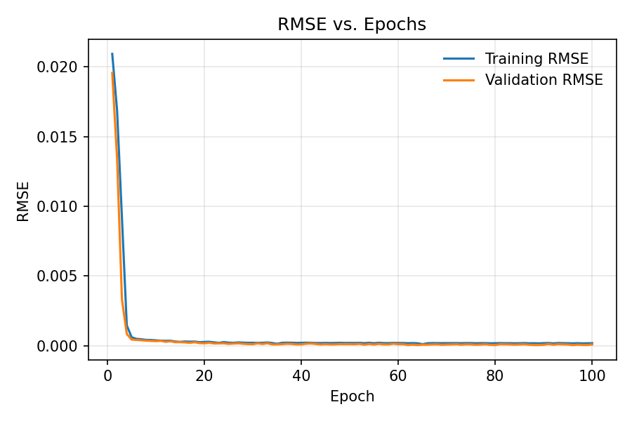
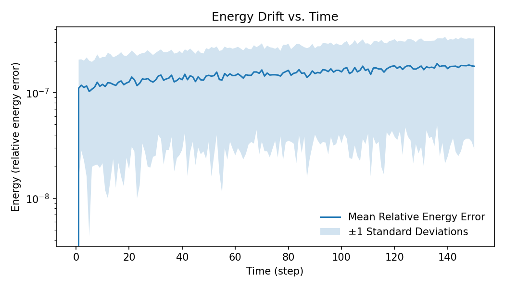
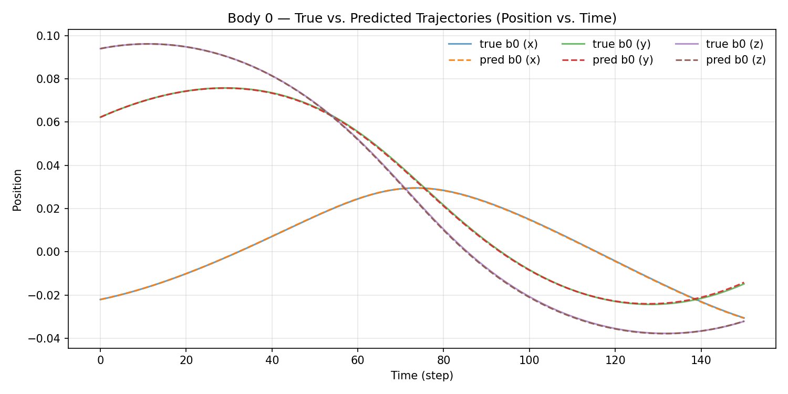
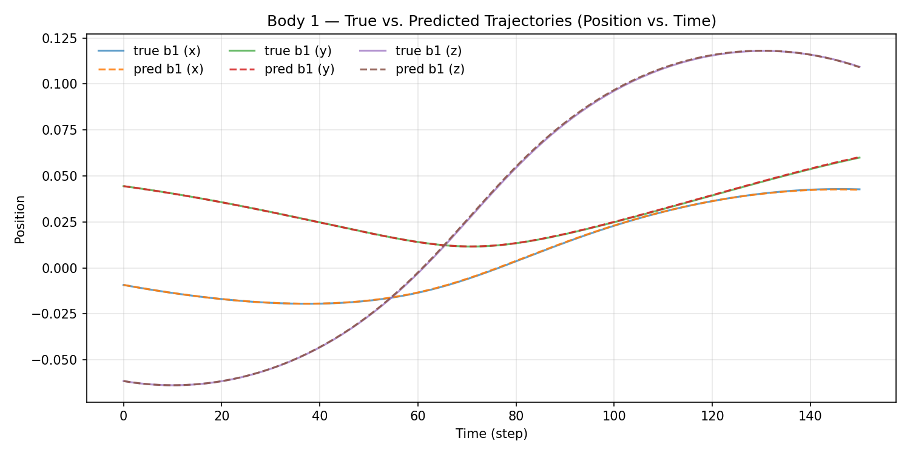
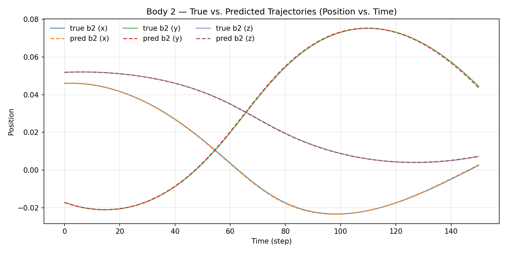
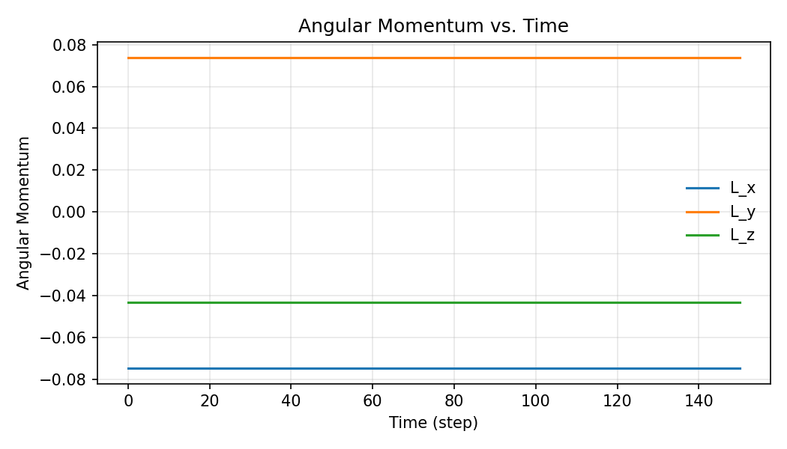
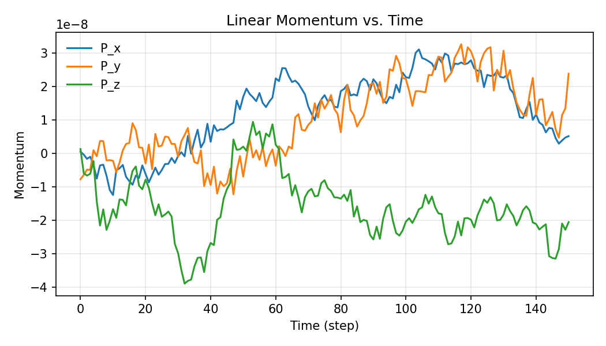
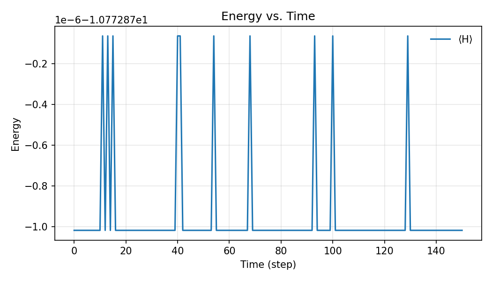

# Hamiltonian Neural Network (HNN) — Three-Body Problem

Train and evaluate a Hamiltonian Neural Network (HNN) on synthetic N-body data (default: 3 bodies in 3D). This repository includes:
- A data generator that simulates Newtonian motion and writes NPZ datasets.
- An HNN trainer/evaluator with losses, integrators, constraints, plots, and checkpoints.

---

## Repository layout

```
.
├── HNN.py                 # HNN model + training/evaluation command-line interface (CLI)
├── data_generator.py      # N-body simulator -> NPZ datasets
├── HNN_train.npz          # example training set (generated)
├── HNN_test.npz           # example test set (generated)
├── hnn.pt                 # example trained checkpoint (if present)
├── requirements.txt       # Python dependencies
└── README.md              # this file
```

---

## Quickstart

> Requires **Python ≥ 3.9** and **PyTorch ≥ 2.0**.

```bash
# 1) Create and activate a local virtual env
python3 -m venv .venv
# Linux/macOS
source .venv/bin/activate
# Windows PowerShell
# .venv\Scripts\Activate.ps1

# 2) Upgrade pip and install dependencies
python -m pip install --upgrade pip
pip install -r requirements.txt

# 3) (Optional) Generate fresh data
python data_generator.py

# 4) Train the HNN (rollout mode auto-detected for provided NPZ), evaluate, and produce plots
python HNN.py
```

> Tip: If you have a CUDA build of PyTorch and a compatible GPU, set `--device cuda` to accelerate training.

---

## Data generation (`data_generator.py`)

`data_generator.py` simulates gravitational N-body dynamics in D=3 dimensions, writing two NPZ files:
- `HNN_train.npz` with pairs `(z_t -> z_{t+1})` for training,
- `HNN_test.npz` with inputs for evaluation/rollouts.

Run:
```bash
python data_generator.py
```

### What to edit to get *more* (or different) data

At the bottom of `data_generator.py` there are two generator instances you can tune:

```python
# TRAIN
train_generator = DataGenerator(D=3, n_bodies=3, max_steps=1000, capture_steps=None, n=800, timestep=0.001)

# TEST
test_generator = DataGenerator(D=3, n_bodies=3, max_steps=1000, capture_steps=None, n=200, timestep=0.001)
```

Change these fields to control dataset size and nature:

- **`n`**: total number of (input -> target) samples to generate. Increase to train on more data (e.g., `n=10000`).  
- **`max_steps`**: maximum time steps simulated per trajectory segment. Larger values can diversify the dynamics before the next sample is taken.  
- **`timestep`**: integration step size (dt). Smaller steps -> smoother dynamics, larger steps -> coarser motion.  
- **`n_bodies`**: number of bodies. Must match the HNN dimensionality (see `--n-bodies`).  
- **`capture_steps`**: `None` yields sequential pairs `(z_t -> z_{t+1})`. Provide a list like `[1,2,3,5,10]` to create non‑sequential samples at those offsets from the initial state.  
- **`D`**: spatial dimension (3 by default).  
- Bonus: **`start_dist`, `eps`, `G`, `m`** tune initial separations, softening, gravitational constant, and mass; velocities are balanced to zero total momentum.

Outputs are written next to the script as `HNN_train.npz` and `HNN_test.npz`. Simple sanity plots are shown at the end.

---

## Training & evaluation (`HNN.py`)

`HNN.py` is a single CLI that loads data, builds the model, trains in either vector‑field or rollout mode, optionally evaluates, and writes diagnostics:

```bash
# Train using NPZ produced by the generator
python HNN.py
```

### Data formats accepted
The script accepts NPZ with any of the following keys (aliases are handled internally):
- Training: `z` (a.k.a. `X`) and either `dz` (a.k.a. `Y`) for vfield mode or `z_next` (a.k.a. `y`) for rollout mode. You can also include a scalar `dt`.  
- Evaluation: `z0` for initial conditions; or `z` / `z_next` pairs for one‑step metrics.

If `z_next` is present and `dz` is not, the script auto‑switches to `--mode rollout`.

### Common recipes

**(A)** Rollout training on next‑state labels (default for the provided NPZ):
```bash
python HNN.py --mode rollout
```

**(B)** Vector‑field training on time derivatives (if you have `dz`):
```bash
python HNN.py --mode vfield
```

**(C)** Using raw `.npy` arrays instead of NPZ:
```bash
python HNN.py --train-z ./z.npy --train-dz ./dz.npy --mode vfield
# or
python HNN.py --train-z ./z.npy --train-z-next ./z_next.npy --mode rollout
```

**(D)** Evaluate a checkpoint and make plots:
```bash
python HNN.py --load ./hnn.pt --rollout-steps 400
```

### What gets saved
- Checkpoint: `--save` (default `./hnn.pt`) stores model weights + CLI config.  
- Metrics: `plots/metrics.csv` (epoch, loss, RMSE).  
- Figures in `./plots/`: training curves, energy drift, momentum over time, per-body line plots of true‑vs‑predicted positions over time, RK4 vs Leapfrog energy, etc:

---

## Full command‑line flags

> All flags have sensible defaults; only supply what you need.

### Data I/O
- `--train-npz PATH` — Training data (`.npz` or `.json`) with `z`/`dz` or `z_next` and optional `dt`. (default: `HNN_train.npz`)
- `--test-npz PATH` — Evaluation data (`.npz` or `.json`) with `z0` or `z`/`z_next` for metrics/plots (default: `HNN_test.npz`)
- `--train-z PATH` — `z.npy` training states `[N, D]` (used if not loading NPZ).
- `--train-dz PATH` — `dz/dt.npy` training labels `[N, D]` (vfield mode).
- `--train-z-next PATH` — next states `z_{t+1}.npy` `[N, D]` (rollout mode).
- `--val-z0 PATH` — initial states for evaluation `[B, D]`.
- `--dt FLOAT` — time step for RK4/labels (default: `1e-3`).

### Model
- `--n-bodies INT` — number of bodies; auto‑detected from `D` if omitted. (`D` must equal `6 * n_bodies`, i.e., 3D positions + 3D momenta per body.)
- `--hidden INT` — MLP hidden width (default: `256`).
- `--depth INT` — MLP depth (default: `3`).
- `--separable` — use separable Hamiltonian `H(q,p)=T(p)+V(q)` (default behaviour when flag is present).
- `--no-learn-mass` — disable learning masses (otherwise masses are learned).
- `--no-tie-body-mass` — untie masses across x/y/z (per‑DOF masses instead of per‑body).

### Constraints
- `--constraint {anchor,pair}` — enable holonomic constraint:
  - `anchor`: keep body 0 at fixed radius from origin; tune with `--anchor-radius` (default `1.0`).
  - `pair`: keep distance between bodies `--pair-i` and `--pair-j` fixed to `--pair-dist` (default `1.0`).

### Training
- `--mode {vfield,rollout}` — training objective (auto‑switches to `rollout` if only `z_next` provided).
- `--epochs INT` (default `100`), `--batch INT` (default `32`), `--lr FLOAT` (default `1e-4`), `--seed INT` (default `420`).
- `--rollout-K INT` — if `>0`, also train a K‑step short‑horizon objective in addition to 1‑step.

### Evaluation & plotting
- `--rollout-steps INT` — steps to roll out for evaluation/plots (default `200`).
- `--integrator {rk4,leapfrog}` — integrator for evaluation rollouts (default `rk4`).
- `--plot-batch-index INT` — which trajectory in the batch to overlay in plots (default `0`).

### General I/O / device
- `--save PATH` — where to save the checkpoint (default `./hnn.pt`).
- `--load PATH` — load an existing checkpoint before training/evaluation.
- `--device {cpu,cuda}` — computation device (default `cpu`).
- `--metrics-csv PATH` — write training/evaluation CSV (default `plots/metrics.csv`).

---

## Data shape conventions

Let `n_bodies = N`, `ndof = 3*N`, `D = 2*ndof = 6*N`.
- A state `z` has shape `[*, D]` and concatenates positions `q` and momenta `p`: `z = [q | p]` with each in `[*, ndof]`.
- `z_next` matches `z`. `dz` is the time derivative with same shape as `z`.
- When plotting overlays, positions are reshaped to `[T, B, N, 3]` to show per‑body 3D tracks.

---

## Results

After training, you should see diagnostics in `plots/` such as:

| Plot | Description |
|------|--------------|
|  | Training & validation RMSE convergence |
|  | Relative energy error over rollout |
|  | Predicted vs true positions of body 0|
|  | Predicted vs true positions of body 1|
|  | Predicted vs true positions of body 2|
|  | Angular momentum conservation |
|  | Linear momentum conservation |
|  | Energy conservation |

These confirm that the HNN preserves physical invariants and matches the generator’s dynamics.

## Troubleshooting

- Shape error like “`expected D divisible by 6`”: make sure `--n-bodies` matches the dataset dimensionality (`D = 6 * n_bodies`).  
- Switching modes unexpectedly: if your training NPZ has `z_next` but not `dz`, the script switches to `--mode rollout`.  
- No plots: ensure you ran with `--test-json` or `--val-z0`, and that the `plots/` folder is writable.  
- CUDA not found: your PyTorch build may be CPU‑only; re‑install a CUDA build or use `--device cpu`.

---

## Reproduction steps

```bash
# (1) Generate data
python data_generator.py

# (2) Train and evaluate + plots
python HNN.py
```
